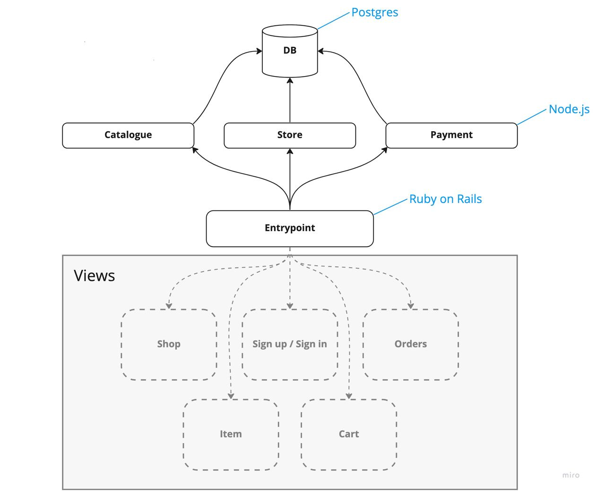

# Internet Shop
This repo contains a backend of a university group project for 'distributed systems' subject.

The goal is to create an internet shop, where people will be able to put up their items for sale or purchase other people's items. People have their internal wallets with virtual money which they use for trading. Integration with real payment systems is beyond the concern of this project. Primary goal is to create a distributed system with microservice architecture where services may communicate with each other.

MVP end should will allow for:
- creating user accounts and logging in
- putting up owned items for sale (providing description, price and other required data)
- browsing other peoples' items using optional filters
- adding items to cart, modifying current order and finalizing it (by performing payment)
- browsing one's past orders
- generating invoices for bought items as pdf files

Backend consists of several microservices each run in docker using compose. This repo contains all those microservies along with configuration files to run everything.

## Architecture and description
*Things you are gonna read down below might be a subject for constant change*



Services:
- Payment Service - manages the payments, checks out orders, issues invoices, etc.
- Catalogue Service - enables users to publish their items, viewing others' items, filtering, etc.
- Store Service - enables cart functionality, order composition, etc.
- Entrypoint Service - provides UI views, handles authorization, routes requests, etc.

Technologies:
- Docker - OS-level virtualization software | running services
- Node.js - runtime environment for JS | backend microservices
- Express - JS library for HTTP servers
- PostgreSQL - a database for storing users, items, orders and other data
- node-postgres (pg) - a JS library for Postgre connection
- Ruby on Rails - web-app framework | backend / UI views


## How to run the backend?
1. Install Docker https://www.docker.com/
2. Clone project
3. Launch Docker on your machine
4. In project directory run 
```sh
docker compose up --build
```
5. You now have everything set up (at least in theory). Try to make a request to one of the services using apps such as Postman (or a browser of your choice)

<br>*Also might be worthwhile to check out individual services READMEs*<br>


## How to contribute?
1. Create a branch for a feature you want to add
2. Push the branch to origin
2. Create a pull request and request a review from one of the team members


## Monitoring
As monitoring/alerting tools this project uses:
- cAdvisor - provides container specific metrics
- Node-Exporter - provides host specific metrics
- Prometheus - collects metrics data
- Loki - aggregates logs from other containers, stores and indexes them
- Promtail - scrapes logs and actually stores them in Loki
- Grafana - used to visualize metrics sourced from Prometheus as well as allows querying logs from Loki

> Current compose config as well as other metric-collecting services' configs were created with a unix host in mind. Current configuration works fine on a MacOS with Docker Desktop for Mac and will *probably* work fine on another *nix system with Docker. Some monitoring services/functinality may or may not work on a Windows machine. This requires further testing/adjustments.

Grafana is available on a 8090 port. Currently it only has one admin user whose password can be looked up in envs passed to Grafana service (in compose file). Upon entering you should be able to view a single existing dashboard (Dashboards -> Browse -> General -> Metrics).

As for logs - those can be queried with Grafana in Explore section (be sure to select Loki as datasource) or from Loki itself which is available on 8094 on the host machine.

Take a note that by default compose only starts the core services without any extra. If you want to run the monitoring services as well, you should use profile:<br>
`docker compose --profile monitoring up`


## Useful resources
Docker overview<br>
https://youtu.be/gAkwW2tuIqE

Docker volumes<br>
https://youtu.be/p2PH_YPCsis

Getting started with Node.js<br>
https://nodejs.dev/en/learn/

Express<br>
https://www.tutorialspoint.com/nodejs/nodejs_express_framework.htm

PG<br>
https://node-postgres.com/